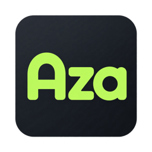

# Aza



Aza (от чеченского «голос») — бесплатный open-source локальный помощник для macOS
в формате Dynamic Island вокруг выреза MacBook. Объединяет четыре функции:

1. время намаза;
2. локальный голосовой ввод (Whisper/WhisperKit, всё на устройстве);
3. автоматическое переключение русской, английской и чеченской раскладок;
4. интеллектуальную историю буфера обмена.

**Всё локально**: без телеметрии, облака и аккаунтов. Подробности — в
[docs/SPEC.md](docs/SPEC.md).

Чеченскую диктовку можно установить отдельно: **Настройки → Диктовка →
Чеченский · OmniASR → Скачать**. Оригинальная `omniASR_CTC_1B_v2` загружается
только по кнопке и работает локально на Apple Silicon. [Подробности](docs/OMNI-ASR.md).

## Статус

Проект на ранней стадии. Рабочее приложение находится в `Aza/` и собирается
проектом `Aza.xcodeproj`; интерфейс острова и системные функции объединены в
одной цели.

| Функция | Состояние |
|---|---|
| Dynamic Island UI (состояния, буфер, расписание) | ✅ интерфейсный прототип |
| Глобальная горячая клавиша (⌘⇧A) | ✅ прототип, подтверждён |
| Прямая вставка текста через Accessibility API | ✅ прототип, подтверждён |
| Исправление слова в неверной раскладке | ✅ прототип (только TextEdit, только `ghbdtn→привет`) |
| Чтение типов NSPasteboard | ✅ прототип (только UTI-типы, без содержимого) |
| Распознавание речи (Whisper) | ❌ не начато |
| Зашифрованная история буфера | ❌ не начата |
| Онбординг, уведомления, DMG, notarization | ❌ не начаты |

## Запуск

Для воспроизводимой сборки используется Xcode 26.6 с macOS SDK.

```bash
xcodebuild -project Aza.xcodeproj -scheme Aza \
  -destination 'platform=macOS' build
```

Для работы нужны разрешения Accessibility и Input Monitoring
(System Settings → Privacy & Security). Debug-сборка использует локальный
самоподписанный сертификат `Aza Development`, чтобы TCC не сбрасывал
разрешения после каждой пересборки — на другой машине настройте свой или
переключите подпись на автоматическую.

## Лицензия

[MIT](LICENSE). Модели распознавания, расписания намаза, звуки азана и
природы, сторонние словари в лицензию не входят и проверяются отдельно.
